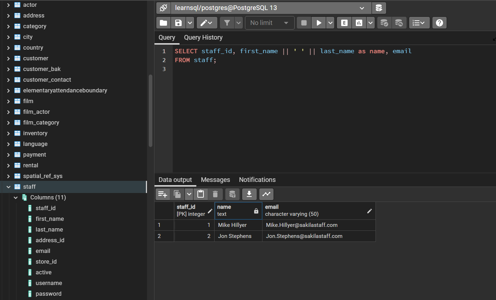

# Learn ST-SQL
 
A markdown template for __GTECH 38519/78519__ ***Geospatial Databases*** Course at Hunter College. <br>
All lab assignments are expected to be submitted using Github markdown files or Github webpages. In the end, you are encouraged to make an open and online portfolio for your database works.<br>

<br> Lab 1, Q1 <br>

SQL Code: <br>

```sql
-- "--" is used to for comments in a line.
-- Example SQL
SELECT employee_id, name, salary 
FROM employees
WHERE dept = 'Geography';

-- End a SQL statement with ":"
-- Then we can start another statement
SELECT staff_id, first_name || ' ' || last_name as name, email
FROM staff;
```
<br>Results in pgAdmin:<br>



<br> Lab 1, Q2 <br>